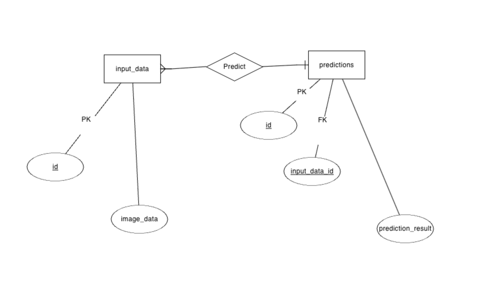

# Milestone 3 Report

## Task 1

**Which services are being used for the application (described in the link above)? How do they relate to the host names in terms of computer networks?**  

The web service uses an image built from the Dockerfile in the current directory. This service is configured to expose port 5000 of the container, mapping it to port 8000 of the host machine​​.
The redis service, on the other hand, uses a public Redis image from Docker Hub. It's a standalone service and does not expose any ports explicitly in this example.
Each container for a service joins the default network created by Docker Compose and is reachable and discoverable by other containers on that network at a hostname identical to the container name​.

**What ports are being used (within the application and in the docker-compose file)?**  

In the Docker Compose file  the Flask application is configured with:
Container port: Port 5000 is where Flask operates inside the Docker container. 
Host port: Port 8000 on the host machine (our laptop) is mapped to the container's port. 
The syntax for port mapping in Docker Compose follows the HOST_ PORT:CONTAINER_PORT format. In this scenario, the mapping is defined as 8000:5000. This configuration facilitates external access to the service running inside the container.
 

**How does the host machine (e.g. your computer) communicate with the application inside the Docker container. Which ports are exposed from the application to the host machine?**  

When localhost:8000 is accessed via a web browser, Docker's network infrastructure redirects this request to port 5000 of the container, where the Flask application resides. This mechanism enables communication between the host machine and the application within the Docker container. The port mapping is essential as it connects the isolated environment of the Docker container with the external environment of the host machine. Without this mapping, the containerized services would remain inaccessible from outside the Docker ecosystem.

**What is localhost, why is it useful in the domain of web applications?**

In computer networking, "localhost" is the term for the user's own computer, connecting through the loopback interface. The IP address range for localhost is 127.0.0.0 to 127.255.255.255, with 127.0.0.1 being the most commonly used. This ensures any connections to localhost are directed back to the same device.

Role in web development:
* Acts as a virtual server for running and testing server-side code on the developer's machine.
* Facilitates local development and testing without internet exposure.
* Loopback to the user's own web server allows for secure and private development.

## Task 2

**a) What is PostgreSQL? Is it SQL or no-SQL (why?)**  

PostgreSQL is an SQL database, using SQL for data management and organizing data in linked tables. This is unlike NoSQL databases, which are designed for less structured data without a fixed table format. However, PostgreSQL also includes NoSQL-like features. A prime example is the ability to process data in JSON format, which is typically associated with semi-structured data, adding flexibility to a traditionally structured SQL environment.

**b)**
To complete this task, we started by setting up a custom Docker network called "mynetwork." This was important for making sure the PostgreSQL database and PGAdmin containers could talk to each other easily.  
Next, we used Docker to pull down the PostgreSQL version 14.0 image. Once we had the image, we ran a PostgreSQL container on "mynetwork." During this setup, we created a user named "student" with a password for the database.  
We also needed Python to work with PostgreSQL, so we installed the psycopg2 package. This package is a bridge between Python and PostgreSQL, letting our Python scripts interact with the database server.  
Then, we wrote a Python script called jokes.py. The script's job was to connect to PostgreSQL, make a new database named ms3_jokes, add a table called jokes, put a joke in it, and then get the joke back out to show it.  
For the database management part, we set up PGAdmin in another Docker container on the same network. This made managing the database easier.  
Finally, in PGAdmin, we did the following:  
Access: opened PGAdmin by going to http://localhost:5050 in our web browser.  
Login: logged in using the email  and password.  
Connection setup: In PGAdmin, we added a new server connection using the name mypostgres for the PostgreSQL container. We used the student user's credentials for this.  

**Challenges and solutions:**
We had  an issue connecting PGAdmin to PostgreSQL database. As we understood at the end this was because we were running both of them in separate Docker containers.  
The solution came from understanding Docker's networking capabilities. We placed both the PostgreSQL and PGAdmin containers on the same custom Docker network (mynetwork). This allowed PGAdmin to communicate with the PostgreSQL container using the container name (mypostgres) as the hostname. 

**c) If you stopped and deleted the Docker container running the database and restarted it. Would your joke still be in the database? Why or why not?**  

If we stop and delete our PostgreSQL container as it's currently set up, we'll lose all the data, including the joke. This is because we didn't use a Docker volume, and data stored inside a container is temporary and disappears with the container.  
However, if we use a Docker volume for our database, the situation changes. With a volume, our data remains safe even if we stop and delete the container. So, if we restart the container and connect it back to the same volume, our joke and all other data in the database will still be there.

## Task 3

**a) How do you need to represent/transform image data to save it to a relational database?**  

To represent and transform image data for saving in a relational database, we need to convert the images into a binary format, because relational databases are optimized for text and numbers, not complex data types like images. And in order to store an image, we must convert it into a binary format (a sequence of bytes).

Workflow steps:

* Using an image processing library: we employed a library like Python's Pillow to handle and process the image data.
* Conversion to binary: Transformed the image into a byte array. This conversion makes it compatible with the storage formats in relational databases.
* Storing in the database: Saved the binary data in a column with a data type suited for binary data, such as BYTEA in PostgreSQL.

**b)Explain how you would define your relational database tables in terms of their attributes to save your data. What kind of data types could you use? What additional relational database table attributes might make sense to easily query your data?**

The MNIST dataset, comprising 28x28 pixel grayscale images of handwritten digits, each labeled with a digit from 0 to 9, is divided into a training set of 60,000 examples and a test set of 10,000 examples.  

The database schema for this dataset could be organized as follows:  

* The Images table is structured to uniquely identify each image with an id column, which serves as the primary key and is assigned the SERIAL data type. This table includes an image_data column for storing images in binary format, utilizing the BYTEA data type. To differentiate between the training and test sets within the dataset, a set_type column is incorporated, using the VARCHAR data type.

* In addition, the schema features a Labels table. This table has an image_id column that acts as a foreign key, referencing the id in the Images Table, and is characterized by the INTEGER data type. The table also includes a label column that records the numerical value each image represents, utilizing the INTEGER data type.  

To enhance the database's querying capabilities, particularly for datasets with more varied content, additional attributes can be added. These include a category or description column (using either VARCHAR or TEXT) to detail the content of each image, a timestamp column to log when images are added to the database (using TIMESTAMP), and a source column (using VARCHAR) to identify the origin of the images. These additions facilitate more efficient queries, such as easily retrieving all images labeled 'giraffe' with a simple SELECT query based on the category or description field.

## Task 4

A 'docker-compose.yml' file along with the wait-for-it.sh (5) have been created, and Dockerfile has been updated. 
The script '1_main.py' got updated with connection to PostgreSQL.
One of our machines had issues with permissions, so a temporary directory was used to run the docker builds. 
However, during the docker compose building process, since the process needed to be restarted quite a few times and all the cache ad volumes needed to be deleted, now we are facing an issue.
docker-compose build executes correctly, but docker-compose up creates an error: incomplete startup packet for postgres, which has been wokring previously.

After continuing to face issues, a new virtual machine has been set up from scratch. After reinstalling all the necessary dependencies, there were still issues with permissions, which were solved by temporary directories. 

A new issue emerged, namely "Error response from daemon: failed to create shim task: OCI runtime create failed: runc create failed: unable to start container process: exec: "./wait-for-it.sh": permission denied: unknown". This was solved by updating the CMD line in the Dockerfile.

Upon running the `docker compose up --build` command, the postgres part had a warning: incomplete startup packet. After some googling, we learned that this can be ignored.

Then finally, docker compose up was running, containers are ready,  when a new issue emerged:
"dstoolkits-python-app-1 exited with code 0".
Therefore, the application exsits and since there are no outputs from '1_main.py', we looked at the script itself. After setting up a virtual environment and running requirements.txt and '1_main.py' in there, we ran into this output: "Segmentation fault (core dumped)".

Accordingly, we started debugging with gdb, which showed an issue within TensorFlow during the optimization of a loop.
We are not sure where this issue is originating, since the tensorflow part of the code has not been changed at all since the last milestone. 

The compose command has been tried on multiple virtual machines, in fact, we have started from scratch many times to make sure it's not the setup that is causing issues. We ended up rethinking our approach.

A missing piece was the 'netcat-openbsd' utility, which is used in the 'wait-for-it.sh' script, a bash script used for waiting until a given host and port are available. It takes a host:port pair as the first argument, waits until the specified service is up, and then executes the provided command.

We decided to add pgAdmin Service, a tool for administration and management for PostgreSQL databases.

We also added a healthcheck, which verifies if the PostgreSQL server is ready to accept connections. This check is performed every 20 seconds and has a timeout cap at 5 seconds, after which  the connection is considered a failure. After 5 consecutive failures the container is marked unhealthy.

Finally, the main script was reorgnaised and the following database structure was introduced:
'input_data' table:
- 'id' (primary key)
- 'image_data'

'predictions' table:
- 'id' (primary key)
- 'input_data_id' (foreign key, referencing 'id' from 'input_data') 
- 'prediction_result'.

There is a one-to-many relationship between 'input_data' and 'predictions'. Each entry in 'input_data' may have multiple corresponding entries in 'predictions', but each entry in 'predictions' is associated with exactly one entry in 'input_data'. 
We chose this simple structure to separate the input data from the predictions. The IDs clearly connect the input with the output, even when multiple predictions are created. This also provides simple data retrieval. It is easily scalable if any new entries need to be added and the model can be evaluated based on the prediction IDs. 

#### Additional: What is an SQL Injection Attack and how can you protect yourself?

An SQL Injection Attack is a cybersecurity threat where attackers manipulate a website's database by inserting harmful SQL code into an application's input fields. To protect against this:  

* Use prepared statements: These are SQL queries with placeholders, preventing direct user input insertion.
* Validate user input: Ensure all user input is checked for malicious code.
* Limit database permissions: Restrict what your application can do in the database (like only reading data).
* Regularly update software: Keep all software, including databases, up to date to patch vulnerabilities.
* Use Web application firewalls: These can help detect and block SQL Injection attempts.

### References:

1. https://www.postgresql.org/about/
2. https://www.freecodecamp.org/news/what-is-localhost/
3. https://www.postgresqltutorial.com/postgresql-python/connect/
4. https://www.postgresql.org/docs/12/datatype-binary.html#id-1.5.7.12.9
5. https://github.com/jirkapinkas/spring-boot-postgresql-docker-compose/blob/master/src/main/docker/wait-for-it.sh
6. https://medium.com/@saklani1408/configuring-healthcheck-in-docker-compose-3fa6439ee280

